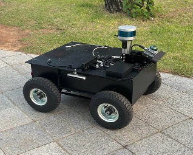
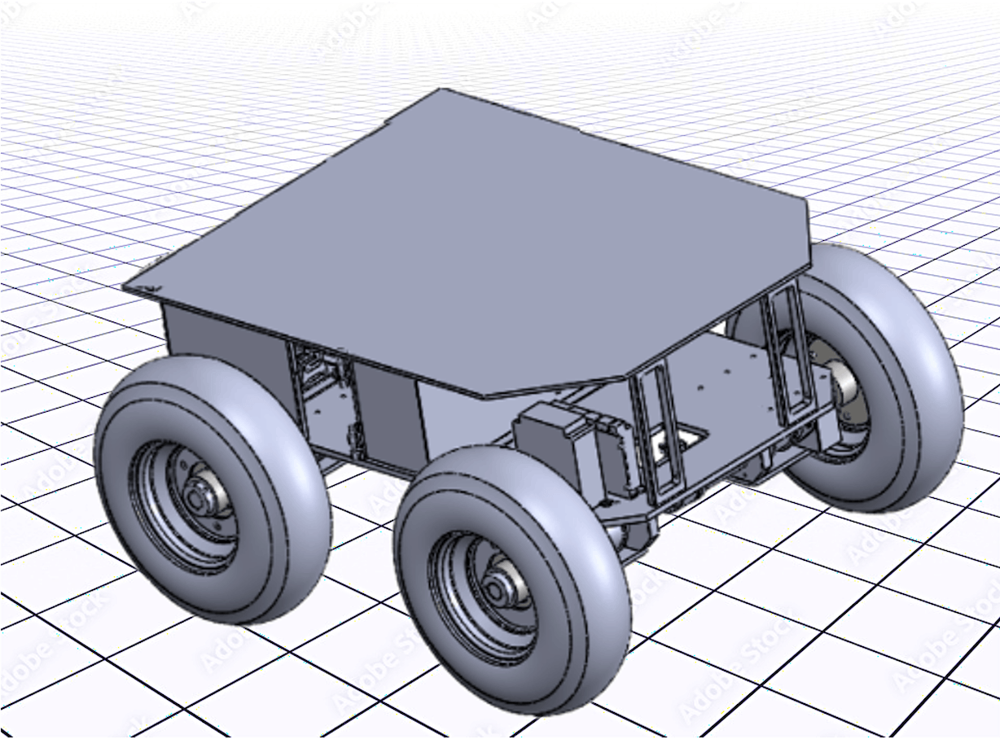
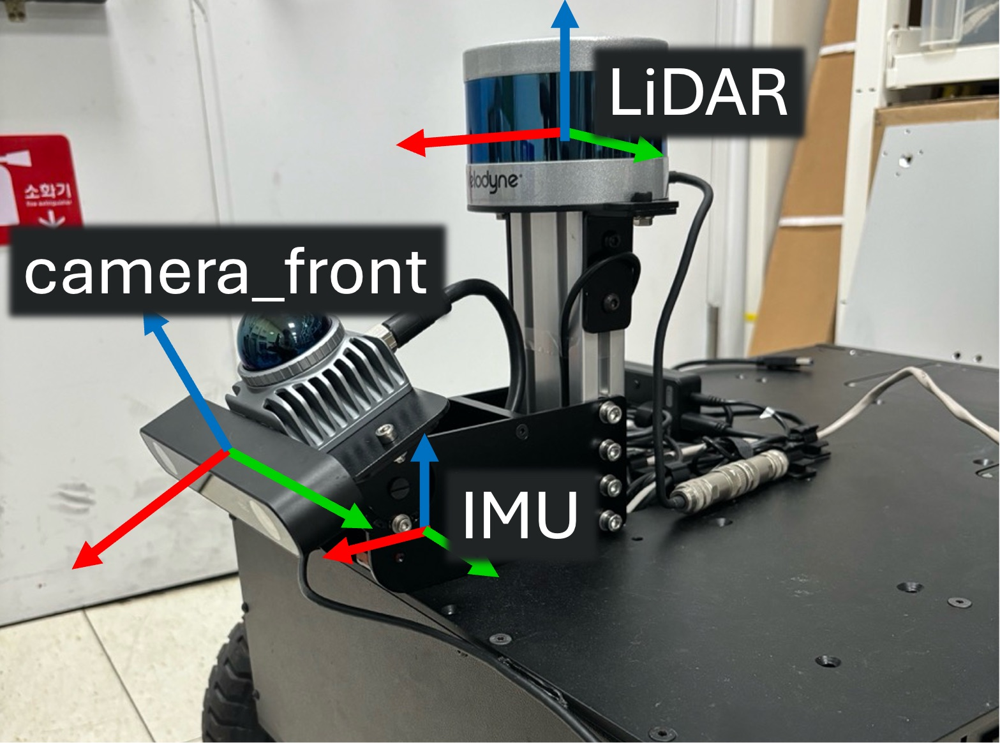
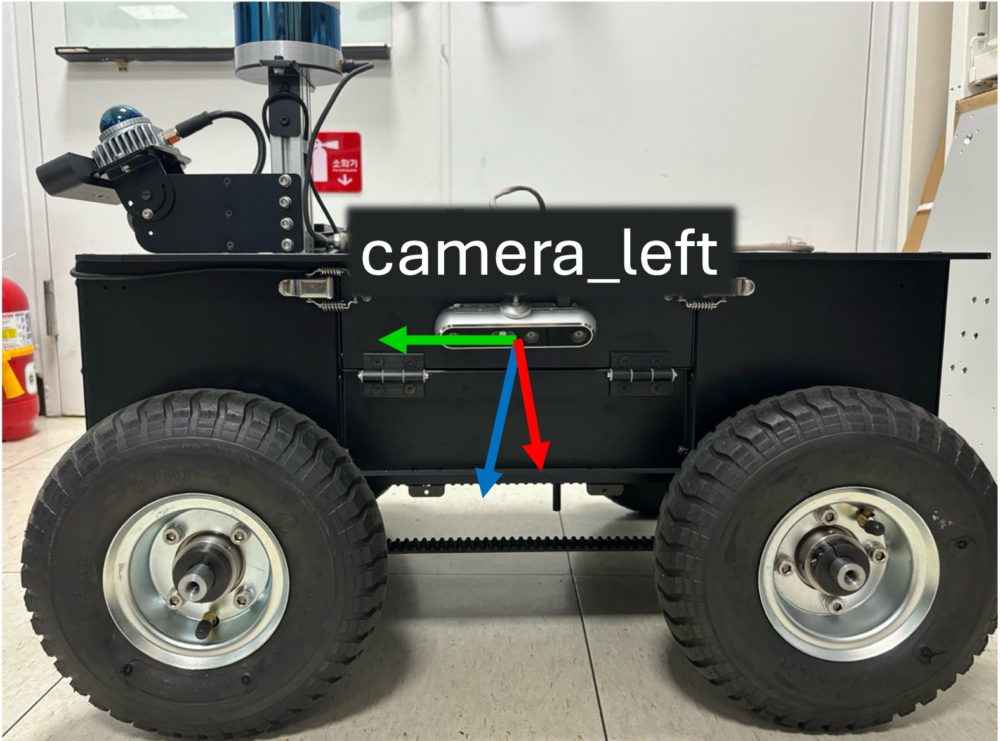
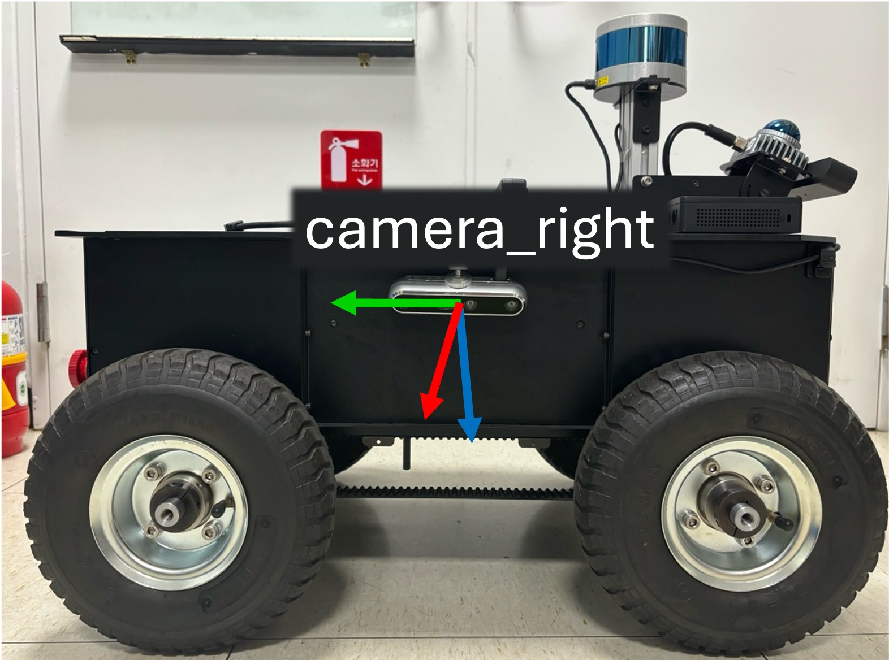

# ISR-M4

This repository provides `isr_m4` ROS driver package implemented for running ISR-M4, the outdoor mobile robot manufactured by Intelligent Systems and Robotics (ISR) Lab. 

<p align='left'>
    
    
</p>

## Sensor Configuration
ISR-M4 is designed for urban living environments and is capable of operating in diverse outdoor terrains. The robot is equipped with the following exteroceptive and proprioceptive sensors.
- 3D LiDARs (Velodyne, Livox)
- Depth Cameras (RGB-D / Stereo)
- IMU
- Wheel encoders

<p align='left'>
    
    
    
</p>

## Installation
**Dependencies:** This software is built on the Robotic Operating System ([ROS](https://www.ros.org/)). We assume that the followings are installed.
- Ubuntu (Tested on 20.04) 
- ROS (Tested on [ROS Noetic](https://wiki.ros.org/noetic))
- [xsens_mti_driver](https://github.com/nobleo/xsens_mti_driver) (for Xsens MTI-30)
- [zed2_ros_tools](https://github.com/Ikhyeon-Cho/zed2_ros_tools) (for Zed camera, custom wrapper package)
- [realsense_ros_tools](https://github.com/Ikhyeon-Cho/realsense_ros_tools.git) (for Realsense camera, custom wrapper package)
- [velodyne_ros_tools](https://github.com/Ikhyeon-Cho/velodyne_ros_tools.git) (for Velodyne LiDAR, custom wrapper package)

Use the following commands for the installation of dependencies:
```
cd ~/{your-ros-workspace}/src
git clone https://github.com/nobleo/xsens_mti_driver                # IMU
git clone https://github.com/Ikhyeon-Cho/zed2_ros_tools             # Zed2 Camera
git clone https://github.com/Ikhyeon-Cho/realsense_ros_tools.git    # Realsense Camera
git clone https://github.com/Ikhyeon-Cho/velodyne_ros_tools.git     # Velodyne
```

**Build:** In order to install the `isr_m4` package, clone the latest version from this repository and compile the package.
```
cd ~/{your-ros-workspace}/src
git clone https://github.com/Ikhyeon-Cho/isr_robot_ros.git -b isr_m4/ros1   # clone branch [isr_m4/ros1]
cd ..
catkin build isr_m4  # or catkin_make
```

## How can I use this driver?
### Run the robot
#### : using run_base.launch
1. Connect to the USB cable on the robot first. 
2. Give port authority to the onboard sensors by using command:
```
rosrun isr_m4 port_authentication.sh
```
3. Run the launch file:
```
roslaunch isr_m4 run_base.launch    # This starts the robot controller, without running sensor drivers
```
> **Note**: By default, the robot runs with the keyboard control. See the launch arguments below for detailed configuration.

4. You can give several command-line arguments to the launch files.

- **`use_joy`** (bool, default: false)<br>
    If True, ISR-M4 will use the joystick with the connected port. By default, `/dev/input/js0`.

- **`publish_odom_tf`** (bool, default: true)<br>
    If False, ISR-M4 will not publish `tf2_msgs/TFMessage`. Only publish the wheel odometry messages in `nav_msgs/Odometry` type.

### Run the robot with sensors
#### : using run.launch
To start with the equipped sensors, you should first ensure that the sensor configuration like [Velodyne VLP-16 LiDAR](https://github.com/Ikhyeon-Cho/velodyne_ros_tools) and [Realsense D455 camera](https://github.com/Ikhyeon-Cho/realsense_ros_tools)  has been done in your laptop. After, follow the instructions:

1. Connect to the USB cable and LAN Cable on the robot.
2. Give port authority to the onboard sensors by using command:
```
rosrun isr_m4 port_authentication.sh
```
3. Run the launch file:
```
roslaunch isr_m4 run.launch     # This starts all the sensor drivers and the robot
```
4. You can also give several command-line arguments to the launch files.

- **`use_joy`** (bool, default: false)<br>
    If True, ISR-M4 will use the joystick with the connected port. By default, `/dev/input/js0`.

- **`publish_odom_tf`** (bool, default: true)<br>
    If False, ISR-M4 will not publish `tf2_msgs/TFMessage`. Only publish the wheel odometry messages in `nav_msgs/Odometry` type.

- **`use_lidar`** (bool, default: true)<br>
    If False, LiDAR sensor driver will not be activated.

- **`use_camera`** (bool, default: false)<br>
    If False, RGB-D sensor driver will not be activated.

- **`use_imu`** (bool, default: true)<br>
    If False, IMU driver will not be activated.

Here is the example command using various launch argument options:
```
# [1] Joystick control
# [2] Don't publish odom_to_baselink transform
# [3] Use RGB-D Camera (and LiDAR, IMU by default)

roslaunch isr_m4 run.launch use_joy:=true publish_odom_tf:=false use_camera:=true
```

### Run the sensors only
#### : using test_sensor.launch
For testing the sensor configuration, the following command can be used. Only the equipped sensors are activated, while the robot remains uncontrolled.

1. Connect to the USB cable and LAN Cable on the robot.
2. Give port authority to the onboard sensors by using command:
```
rosrun isr_m4 port_authentication.sh
```
3. Run the launch file:
```
roslaunch isr_m4 test_sensor.launch
```
The followings are possible launch arguments:
- **`use_lidar`** (bool, default: true)<br>
    If False, LiDAR sensor driver will not be activated.

- **`use_camera`** (bool, default: true)<br>
    If False, RGB-D sensor driver will not be activated.

- **`use_imu`** (bool, default: true)<br>
    If False, IMU driver will not be activated.

## Tools
### Recording the data
Using `isr_m4_tools` package, you can use this simple one-line command to record the data in rosbag files:
```
roslaunch isr_m4_tools record_data.launch 
```
Then after, the recording starts in the terminal. When the robot ends the data recording process, then just use `Ctrl-C` to finish rosbag recording.
> **Note 1**: By default, the projecy name is set to `m4_dataset`. Therefore, the recorded data is saved in `~/Downloads/m4_dataset` folder. 

To specify the project name by yourself, use `project_name:=` arguments like below:
```
roslaunch isr_m4_tools record_data.launch project_name:={specify-your-project-name}
```

> **Note 2**: Each sensor has its own rosbag. That is, when you use the robot, a single lidar, and a single camera, there will be three rosbag files. This design is due to the high-bandwith and cpu requirements for logging the camera images. Fortunately, we can obtain the merged bag files after finishing the whole recording process.  

To merge the all rosbag files, run the following command:
```
roslaunch isr_m4_tools merge_data.launch project_name:={your-project-name}
```

### Visualize the recorded data
Use the following command to visualize recorded rosbag in Rviz:
```
roslaunch isr_m4_tools test_playback_data.launch project_name:={your-project-name}
```
or, you can disable Rviz by the command:
```
roslaunch isr_m4_tools playback_data.launch project_name:={your-project-name}
```
The followings are possible launch arguments:
- **`project_name`** (string, default: "") (Empty string points `~/Downloads/`)<br>
    The default path is `~/Downloads/`. If you give an argument, then `~/Downloads/{argument} `

- **`bag_file`** (string, default: "isr_m4_dataset.bag")<br>
    The name of the rosbag file to be played.

- **`playback_speed`** (double, default: 1.0)<br>
    The playback speed of bagfile.

- **`start_time`** (double, default: 1.0)<br>
    The start time of bagfile playback.

### Visualize the robot model
Use the following command to visualize robot model in Rviz:
```
roslaunch isr_m4_description robot_model.launch
```
