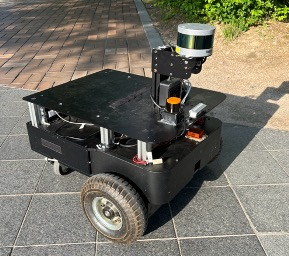
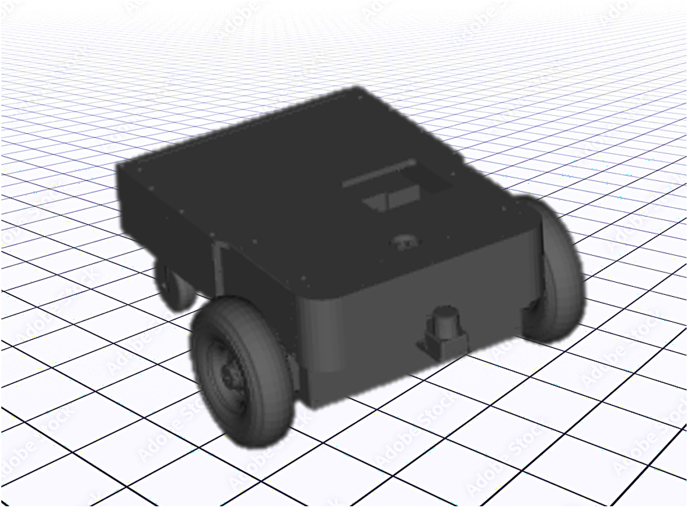

# ISR-M3
This repository provides `isr_m3` ROS driver package implemented for running ISR-M3, the indoor/outdoor mobile robot manufactured by Intelligent Systems and Robotics (ISR) Lab. 

<p align='center'>
    
    
</p>

ISR-M4 is designed for urban living environments and is capable of operating in diverse outdoor terrains. The robot is equipped with the following exteroceptive and proprioceptive sensors.
- 3D LiDAR (Velodyne)
- IMU
- Wheel encoders

## Installation
**Dependencies:** This software is built on the Robotic Operating System ([ROS](https://www.ros.org/)). We assume that the followings are installed.
- Ubuntu (Tested on 20.04) 
- ROS (Tested on [ROS Noetic](https://wiki.ros.org/noetic))
- [xsens_mti_driver](https://github.com/nobleo/xsens_mti_driver) (for Xsens MTI-30)
- [velodyne_ros_tools](https://github.com/Ikhyeon-Cho/velodyne_ros_tools.git) (for Velodyne LiDAR, custom wrapper package)

Use the following commands for the installation of dependencies:
```
cd ~/{your-ros-workspace}/src
git clone https://github.com/nobleo/xsens_mti_driver                # IMU
git clone https://github.com/Ikhyeon-Cho/velodyne_ros_tools.git     # Velodyne
```
**Build:** In order to install `isr_m3` ROS driver, clone the latest version from this repository and compile the package.
```
cd ~/{your-ros-workspace}/src
git clone https://github.com/Ikhyeon-Cho/isr_robot_ros.git -b isr_m3/ros1   # clone branch [isr_m3/ros1]
cd ..
catkin build isr_m3_bringup  # or catkin_make
```
## How can I use this driver?
### Run the robot
To start running ISR-M3 robot, you should connect to the robot first. After, use the command below:

```
roslaunch isr_m3_bringup run_base.launch    # This starts the robot controller
```

To start with the sensors, you should first ensure that the sensor configuration like [Velodyne VLP-16](http://wiki.ros.org/velodyne/Tutorials/Getting%20Started%20with%20the%20Velodyne%20VLP16) and [Realsense Depth Camera](https://github.com/Ikhyeon-Cho/realsense_ros_tools)  has been done in your laptop. After, use the command below:
```
roslaunch isr_m3_bringup run.launch     # Start all sensor drivers and the robot
```
You can give several command-line arguments to the launch files.

**run_base.launch**
- **`use_joy`** (bool, default: false)<br>
    When set to `true`, ISR-M3 will use the joystick with the connected port. By default, `/dev/input/js0`.

- **`publish_odom_tf`** (bool, default: true)<br>
    When set to `false`, ISR-M3 will only publish the wheel odometry messages in nav_msgs/Odometry type.

**run.launch**
- **`use_joy`** (bool, default: false)<br>
    When set to `true`, ISR-M3 will use the joystick with the connected port. By default, `/dev/input/js0`.

- **`publish_odom_tf`** (bool, default: true)<br>
    When set to `false`, ISR-M3 will only publish the wheel odometry messages in `nav_msgs/Odometry` type.

- **`use_lidar`** (bool, default: true)<br>
    When set to `false`, LiDAR sensor driver will not be activated.

- **`use_camera`** (bool, default: false)<br>
    When set to `true`, RGB-D sensor driver will be activated.

Here is the example command using various launch argument options:
```
# Control robot with joystick
# Don't publish odom_to_baselink tf
# Use RGB-D Camera (and LiDAR by default)

roslaunch isr_m3_bringup run.launch use_joy:=true publish_odom_tf:=false use_camera:=true
```
